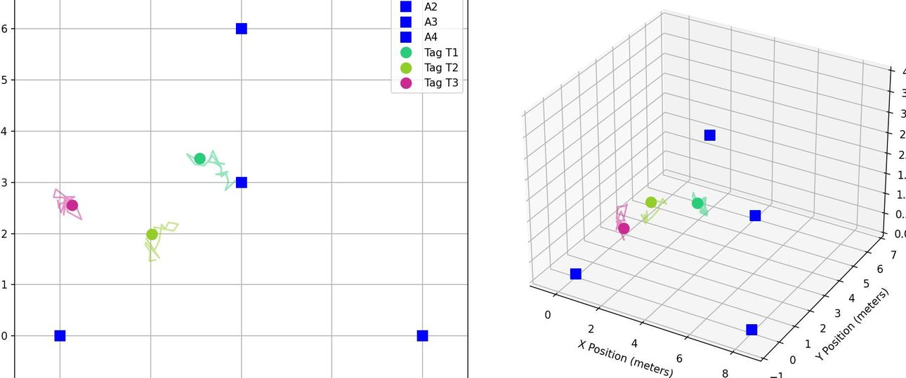

# ESP32 UWB Indoor Positioning System Project
# ESP32 UWB 室內定位系統專案

[English Version](#english-version) | [中文版本](#中文版本)


*Real-time visualization of UWB position tracking / UWB 定位即時視覺化展示*

---

## English Version

### Introduction
The ESP32 UWB Indoor Positioning System is an open-source project that combines Ultra-Wideband (UWB) technology with ESP32 microcontrollers to create a high-precision indoor positioning solution. By utilizing the DW3000 UWB module, this system achieves centimeter-level positioning accuracy, making it ideal for various indoor tracking applications.

#### Why UWB Technology?
Ultra-Wideband technology offers several advantages over other indoor positioning technologies:

| Technology | Accuracy | Range | Power Consumption | Cost | Through-wall Capability |
|------------|----------|--------|-------------------|------|----------------------|
| UWB | 10-30cm | 30-60m | Medium | Medium | Limited |
| Bluetooth | 1-3m | 10-30m | Low | Low | Poor |
| WiFi | 3-5m | 50-100m | High | Low | Good |
| RFID | 1-2m | 1-10m | Very Low | Low | Poor |

### Main Features
- High-precision positioning (centimeter-level accuracy)
- Real-time 2D/3D position tracking and visualization
- Support for up to 3 simultaneous tracking tags with dynamic color coding
- Optimized 4-anchor configuration for 3D positioning (3 ground + 1 ceiling)
- Independent motion trajectory tracking for each tag
- WiFi connectivity for data transmission
- Python-based real-time visualization tool
- Open-source and customizable

### Technical Specifications

#### Hardware Specifications
- **Microcontroller**: ESP32-WROOM-32
  * CPU: Dual-core Xtensa LX6, up to 240MHz
  * RAM: 520KB SRAM
  * Flash Memory: 4MB

- **UWB Module**: DW3000
  * Frequency Band: 6.5GHz and 8GHz
  * Channel Bandwidth: 500MHz and 900MHz
  * Data Rate: Up to 6.8Mbps
  * Ranging Accuracy: Approximately 10cm

- **Power Requirements**
  * Operating Voltage: 3.3V
  * Current Consumption:
    - Sleep Mode: <1mA
    - Operating Mode: 130mA
    - UWB Transmission Peak: 280mA

#### Performance Metrics
- **Positioning Accuracy**:
  * 2D Mode: 10-20cm
  * 3D Mode: 20-30cm
  * Update Rate: 10Hz (configurable)

- **Range Limitations**:
  * Maximum Range: 8.0m (configurable)
  * Minimum Range: 0.2m
  * Optimal Performance Range: 0.5-6.0m

### System Implementation

1. **Anchor Nodes (ESP32 + DW3000)**
   - Six fixed-position reference points
   - Optimized 3D positioning layout
   - Continuous ranging with moving tags
   - WiFi data transmission capability
   - Configurable update rate (10-100Hz)
   - Automatic anchor discovery

2. **Moving Tags (ESP32 + DW3000)**
   - Support for up to 3 simultaneous tracking tags
   - Real-time 3D position calculation
   - Independent motion trajectory tracking
   - Dynamic color assignment
   - WiFi status broadcasting
   - Built-in motion detection
   - Low-power mode support

3. **Visualization System (Python)**
   - Split-screen display:
     * 2D top-down view
     * 3D perspective view
   - Multi-tag tracking support (up to 3 tags)
   - Real-time position updates
   - Basic movement visualization

Planned future features:
   - Data recording and analysis
   - Movement trail tracking
   - Advanced filtering
   - Heat map generation

### Practical Application Examples

#### 3D Positioning Setup
```
Room Size: 6m x 8m x 3m
Anchor Configuration:
- Ground Level Anchors:
  * Anchor 0: (0, 0, 0) - Corner
  * Anchor 1: (6m, 0, 0) - Corner
  * Anchor 2: (3m, 8m, 0) - Middle of far wall
- Ceiling Level Anchor:
  * Anchor 3: (3m, 4m, 3m) - Center ceiling

Typical Results:
- Static Accuracy:
  * XY Plane: ±15cm
  * Z-axis: ±20cm
- Dynamic Accuracy:
  * XY Plane: ±25cm
  * Z-axis: ±30cm
- Update Rate: 10Hz
- Coverage: 85% of room volume
```

### Application Scenarios
- **Indoor Robot Navigation**
  * Autonomous mobile robots
  * Warehouse automation
  * Smart factory navigation

- **Asset Tracking**
  * Warehouse inventory management
  * Equipment location tracking
  * Tool management systems

- **Personnel Positioning**
  * Emergency response tracking
  * Worker safety monitoring
  * Patient tracking in hospitals

- **Interactive Devices**
  * Museum interactive exhibits
  * Virtual/augmented reality systems
  * Interactive art installations

- **Research and Education**
  * Robotics research
  * Navigation algorithm development
  * Student projects

### Future Development
- Enhanced filtering algorithms
- Mobile app development
- Battery life optimization
- Multi-tag support
- Integration with other positioning systems

### Known Limitations and Solutions
1. **Metal Interference**
   - Problem: Metal objects can reflect signals
   - Solution: Strategic anchor placement and signal filtering

2. **Line-of-Sight Requirements**
   - Problem: Optimal accuracy requires clear line-of-sight
   - Solution: Increase additional anchors for better coverage

3. **Power Consumption**
   - Problem: Continuous ranging uses significant power
   - Solution: Implement adaptive update rates

---

*This project is licensed under the MIT License - see the LICENSE file for details*
*本專案採用 MIT 授權 - 詳見 LICENSE 文件*

## 中文版本

### 簡介
ESP32 UWB 室內定位系統是一個開源專案，結合超寬頻（UWB）技術與 ESP32 微控制器，創建了一個高精度的室內定位解決方案。通過使用 DW3000 UWB 模組，本系統可以實現厘米級的定位精度，非常適合各種室內追蹤應用。

#### 為什麼選擇 UWB 技術？
超寬頻技術相比其他室內定位技術具有多項優勢：

| 技術 | 精確度 | 範圍 | 功耗 | 成本 | 穿牆能力 |
|-----|--------|------|------|------|----------|
| UWB | 10-30厘米 | 30-60米 | 中等 | 中等 | 有限 |
| 藍牙 | 1-3米 | 10-30米 | 低 | 低 | 差 |
| WiFi | 3-5米 | 50-100米 | 高 | 低 | 好 |
| RFID | 1-2米 | 1-10米 | 極低 | 低 | 差 |

### 主要特點
- 高精度定位（厘米級精確度）
- 分屏 2D/3D 即時位置追蹤和視覺化
- 支援最多 3 個同時追蹤標籤，具有動態顏色編碼
- 優化的 4 點錨點配置，用於 3D 定位（3個地面 + 1個天花板）
- 每個標籤獨立的運動軌跡追蹤
- WiFi 連接數據傳輸
- Python 即時更新視覺化工具
- 開源且易於客製化

### 技術規格

#### 硬體規格
- **微控制器**: ESP32-WROOM-32
  * CPU：雙核 Xtensa LX6，最高 240MHz
  * RAM：520KB SRAM
  * 快閃記憶體：4MB

- **UWB 模組**: DW3000
  * 頻段：6.5GHz 和 8GHz
  * 通道頻寬：500MHz 和 900MHz
  * 數據率：最高 6.8Mbps
  * 測距精度：約 10 厘米

- **電源需求**
  * 工作電壓：3.3V
  * 電流消耗：
    - 睡眠模式：<1mA
    - 工作模式：130mA
    - UWB 傳輸峰值：280mA

#### 性能指標
- **定位精度**：
  * 2D 模式：10-20 厘米
  * 3D 模式：20-30 厘米
  * 更新率：10Hz（可配置）

- **範圍限制**：
  * 最大範圍：8.0 米（可配置）
  * 最小範圍：0.2 米
  * 最佳性能範圍：0.5-6.0 米

### 系統實現

1. **錨點節點 (ESP32 + DW3000)**
   - 六個固定位置參考點
   - 優化的 3D 定位佈局
   - 與移動標籤持續測距
   - WiFi 數據傳輸能力
   - 可配置更新率（10-100Hz）
   - 自動錨點發現

2. **移動標籤 (ESP32 + DW3000)**
   - 支援最多 3 個同時追蹤標籤
   - 即時 3D 位置計算
   - 獨立運動軌跡追蹤
   - 動態顏色分配
   - WiFi 狀態廣播
   - 內建運動檢測
   - 低功耗模式支援

3. **視覺化系統 (Python)**
   - 分屏顯示：
     * 2D 俯視圖
     * 3D 立體視圖
   - 多標籤追蹤支援（最多3個標籤）
   - 即時位置更新
   - 基本運動視覺化

計劃中的功能：
   - 數據記錄和分析
   - 運動軌跡追蹤
   - 進階濾波
   - 熱力圖生成

### 實際應用示例

#### 3D 定位設定
```
房間大小：6m x 8m x 3m
錨點配置：
- 地面層錨點：
  * 錨點 0：（0，0，0）- 角落
  * 錨點 1：（6m，0，0）- 角落
  * 錨點 2：（3m，8m，0）- 遠牆中點
- 天花板層錨點：
  * 錨點 3：（3m，4m，3m）- 天花板中心

典型結果：
- 靜態精度：
  * XY 平面：±15cm
  * Z 軸：±20cm
- 動態精度：
  * XY 平面：±25cm
  * Z 軸：±30cm
- 更新率：10Hz
- 覆蓋率：85% 房間體積
```

### 應用場景
- **室內機器人導航**
  * 自主移動機器人
  * 倉庫自動化
  * 智慧工廠導航

- **資產追蹤**
  * 倉庫庫存管理
  * 設備位置追蹤
  * 工具管理系統

- **人員定位**
  * 緊急應變追蹤
  * 工人安全監控
  * 病人追蹤在醫院

- **互動裝置**
  * 博物館互動展示
  * 虛擬/增強實境系統
  * 互動藝術裝置

- **研究和教育**
  * 機器人研究
  * 導航演算法開發
  * 學生專案

### 未來發展
- 增強濾波演算法
- 移動應用程式開發
- 電池效能優化
- 多標籤支援
- 與其他定位系統整合

### 已知限制和解決方案
1. **金屬干擾**
   - 問題：金屬物體可以反射信號
   - 解決方案：策略錨點佈置和信號濾波

2. **視線要求**
   - 問題：最佳精度需要清晰視線
   - 解決方案：增加額外錨點以獲得更好的覆蓋率

3. **功耗**
   - 問題：持續測距使用大量功耗
   - 解決方案：實現適應性更新率

---
