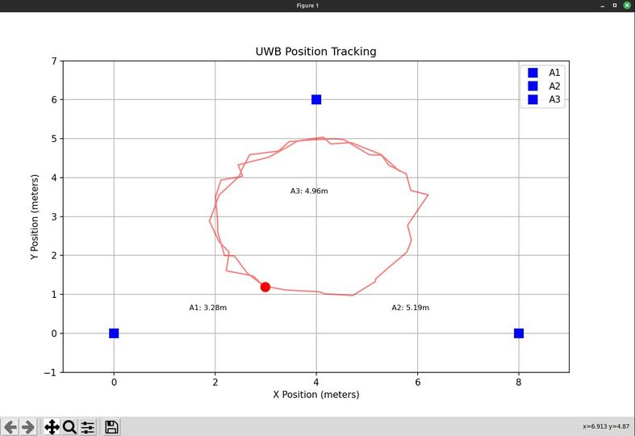

# ESP32 UWB Indoor Positioning System Project
# ESP32 UWB 室內定位系統專案

[English Version](#english-version) | [中文版本](#中文版本)


*Real-time visualization of UWB position tracking / UWB 定位即時視覺化展示*

---

## English Version

### Introduction
The ESP32 UWB Indoor Positioning System is an open-source project that combines Ultra-Wideband (UWB) technology with ESP32 microcontrollers to create a high-precision indoor positioning solution. By utilizing the DW3000 UWB module, this system achieves centimeter-level positioning accuracy, making it ideal for various indoor tracking applications.

#### Why UWB Technology?
Ultra-Wideband technology offers several advantages over other indoor positioning technologies:

| Technology | Accuracy | Range | Power Consumption | Cost | Through-wall Capability |
|------------|----------|--------|-------------------|------|----------------------|
| UWB | 10-30cm | 30-60m | Medium | Medium | Limited |
| Bluetooth | 1-3m | 10-30m | Low | Low | Poor |
| WiFi | 3-5m | 50-100m | High | Low | Good |
| RFID | 1-2m | 1-10m | Very Low | Low | Poor |

### Key Features
- High-precision positioning (centimeter-level accuracy)
- Real-time position tracking and visualization
- Support for 2D and 3D positioning
- Flexible anchor configuration (2-5+ anchors)
- WiFi connectivity for data transmission
- Python-based visualization tools
- Open-source and easily customizable

### Technical Specifications

#### Hardware Specifications
- **Microcontroller**: ESP32-WROOM-32
  * CPU: Dual-core Xtensa LX6, up to 240MHz
  * RAM: 520KB SRAM
  * Flash: 4MB

- **UWB Module**: DW3000
  * Frequency Band: 6.5GHz and 8GHz
  * Channel Bandwidth: 500MHz and 900MHz
  * Data Rate: Up to 6.8Mbps
  * Ranging Accuracy: ~10cm

- **System Parameters**
  * Maximum Anchors: 10
  * Minimum Anchors for Positioning: 2
  * Maximum Valid Distance: 8.0m
  * Anchor Data Timeout: 5s
  * UDP Broadcast Interval: 100ms
  * JSON Buffer Size: 512 bytes (for multiple anchors)

- **Default Configuration**
  ```cpp
  // Tag Configuration (range_rx.ino)
  const uint8_t TAG_ADDR[] = { 'T', '1' };      // Tag Address
  // Configure anchor list for Tag
  #define NUM_ANCHORS 3  // Number of anchors
  static const char ANCHOR_LIST[NUM_ANCHORS][2] = {
      {'A', '1'},  // Anchor 1
      {'A', '2'},  // Anchor 2
      {'A', '3'}   // Anchor 3
  };

  // Anchor Configuration (range_tx.ino)
  const uint8_t ANCHOR_ADDR[] = { 'A', '1' };   // Change for each anchor
  ```

- **Network Features**
  * Optional WiFi Connectivity
  * UDP Broadcast (when WiFi enabled)
  * JSON Data Format
  * Configurable Update Rate

#### Performance Metrics
- **Positioning Accuracy**:
  * 2D Mode: 10-20cm
  * 3D Mode: 20-30cm
  * Update Rate: 10Hz (configurable)

- **Range Limitations**:
  * Maximum Range: 8.0m (configurable)
  * Minimum Range: 0.2m
  * Optimal Performance Range: 0.5m - 6.0m

### Technical Details

#### Positioning Principles
The system uses different numbers of anchors to achieve various positioning capabilities:

1. **Two Anchors**
   - Basic distance measurements
   - Provides two possible positions (circle intersection)
   - Suitable for simple distance testing

2. **Three Anchors**
   - Enables basic 2D positioning
   - Uses triangulation for position calculation
   - May have position ambiguity

3. **Four Anchors**
   - Full 2D/3D positioning capability
   - Unique position determination
   - Height measurement (with non-coplanar arrangement)

4. **Five or More Anchors**
   - Enhanced positioning accuracy
   - Redundant measurements for better reliability
   - Ideal for challenging environments

#### System Architecture

*System architecture showing anchor placement and tag tracking*

### Implementation
The project consists of three main components:

1. **Anchor Nodes (ESP32 + DW3000)**
   - Fixed position reference points
   - Continuous ranging with mobile tags
   - WiFi data transmission capability
   - Configurable update rate (10-100Hz)
   - Automatic anchor discovery

2. **Mobile Tags (ESP32 + DW3000)**
   - Position calculation using trilateration
   - Real-time data processing
   - WiFi status broadcasting
   - Built-in movement detection
   - Low-power modes support

3. **Visualization System (Python)**
   - Real-time position plotting
   - Data recording and analysis
   - Simulation capabilities
   - Current visualization features:
     * 2D top-down view
     * Real-time movement trail
     * Distance measurements display
   - Planned future features:
     * 3D perspective view
     * Heat map generation
     * Multi-tag tracking visualization

### Real-World Setup Example

#### Basic 2D Positioning Setup
```
Room Size: 6m x 8m
Anchor Configuration:
- Anchor 1: (0, 0) - Corner
- Anchor 2: (6m, 0) - Corner
- Anchor 3: (3m, 8m) - Middle of opposite wall
Height: All anchors at 2m height

Typical Results:
- Static Accuracy: ±15cm
- Dynamic Accuracy: ±25cm
- Update Rate: 10Hz
- Coverage: 90% of room area
```

### Applications
- **Indoor Robot Navigation**
  * Autonomous mobile robots
  * Warehouse automation
  * Smart factory navigation

- **Asset Tracking**
  * Warehouse inventory management
  * Equipment location tracking
  * Tool management systems

- **Personnel Positioning**
  * Emergency response tracking
  * Worker safety monitoring
  * Patient tracking in hospitals

- **Interactive Installations**
  * Museum interactive displays
  * Virtual/Augmented reality systems
  * Interactive art installations

- **Research and Education**
  * Robotics research
  * Navigation algorithm development
  * Student projects

### Future Development
- Enhanced filtering algorithms
- Mobile app development
- Battery optimization
- Multi-tag support
- Integration with other positioning systems

### Known Limitations and Solutions
1. **Metal Interference**
   - Problem: Metal objects can reflect signals
   - Solution: Strategic anchor placement and signal filtering

2. **Line of Sight Requirements**
   - Problem: Best accuracy requires clear line of sight
   - Solution: Add additional anchors for better coverage

3. **Power Consumption**
   - Problem: Continuous ranging uses significant power
   - Solution: Implemented adaptive update rates

---

## 中文版本

### 簡介
ESP32 UWB 室內定位系統是一個開源專案，結合超寬頻（UWB）技術與 ESP32 微控制器，創建了一個高精度的室內定位解決方案。通過使用 DW3000 UWB 模組，本系統可以實現厘米級的定位精度，非常適合各種室內追蹤應用。

#### 為什麼選擇 UWB 技術？
超寬頻技術相比其他室內定位技術具有多項優勢：

| 技術 | 精確度 | 範圍 | 功耗 | 成本 | 穿牆能力 |
|-----|--------|------|------|------|----------|
| UWB | 10-30厘米 | 30-60米 | 中等 | 中等 | 有限 |
| 藍牙 | 1-3米 | 10-30米 | 低 | 低 | 差 |
| WiFi | 3-5米 | 50-100米 | 高 | 低 | 好 |
| RFID | 1-2米 | 1-10米 | 極低 | 低 | 差 |

### 主要特點
- 高精度定位（厘米級精確度）
- 即時位置追蹤和視覺化
- 支援 2D 和 3D 定位
- 靈活的錨點配置（2-5+ 個錨點）
- WiFi 連接數據傳輸
- Python 視覺化工具
- 開源且易於客製化

### 技術規格

#### 硬體規格
- **微控制器**: ESP32-WROOM-32
  * CPU：雙核 Xtensa LX6，最高 240MHz
  * RAM：520KB SRAM
  * 快閃記憶體：4MB

- **UWB 模組**: DW3000
  * 頻段：6.5GHz 和 8GHz
  * 通道頻寬：500MHz 和 900MHz
  * 數據率：最高 6.8Mbps
  * 測距精度：約 10 厘米

- **系統參數**
  * 最大錨點數：10
  * 最少錨點數（定位）：2
  * 最大有效距離：8.0 米
  * 錨點數據超時：5 秒
  * UDP 廣播間隔：100 毫秒
  * JSON Buffer Size: 512 bytes (for multiple anchors)

- **預設配置**
  ```cpp
  // 標籤配置 (range_rx.ino)
  const uint8_t TAG_ADDR[] = { 'T', '1' };      // 標籤地址
  // Configure anchor list for Tag
  #define NUM_ANCHORS 3  // Number of anchors
  static const char ANCHOR_LIST[NUM_ANCHORS][2] = {
      {'A', '1'},  // 錨點 1
      {'A', '2'},  // 錨點 2
      {'A', '3'}   // 錨點 3
  };

  // 錨點配置 (range_tx.ino)
  const uint8_t ANCHOR_ADDR[] = { 'A', '1' };   // Change for each anchor
  ```

- **網絡功能**
  * 可選 WiFi 連接
  * UDP 廣播（當 WiFi 啟用）
  * JSON 數據格式
  * 可配置更新率

#### 性能指標
- **定位精度**：
  * 2D 模式：10-20 厘米
  * 3D 模式：20-30 厘米
  * 更新率：10Hz（可配置）

- **範圍限制**：
  * 最大範圍：8.0 米（可配置）
  * 最小範圍：0.2 米
  * 最佳性能範圍：0.5-6.0 米

### 技術細節

#### 定位原理
系統使用不同數量的錨點來實現各種定位功能：

1. **兩個錨點**
   - 基本距離測量
   - 提供兩個可能位置（圓的交點）
   - 適合簡單的距離測試

2. **三個錨點**
   - 實現基本的 2D 定位
   - 使用三角測量計算位置
   - 可能存在位置歧義

3. **四個錨點**
   - 完整的 2D/3D 定位能力
   - 唯一位置確定
   - 可測量高度（非共面排列時）

4. **五個或更多錨點**
   - 增強定位精確度
   - 冗餘測量提高可靠性
   - 適合複雜環境

#### 系統架構

*系統架構展示錨點佈置和標籤追蹤*

### 實現方式
專案包含三個主要組件：

1. **錨點節點（ESP32 + DW3000）**
   - 固定位置參考點
   - 持續與移動標籤進行測距
   - WiFi 數據傳輸功能
   - 可配置更新率（10-100Hz）
   - 自動錨點發現

2. **移動標籤（ESP32 + DW3000）**
   - 位置計算使用三角測量
   - 即時數據處理
   - WiFi 狀態廣播
   - 內建運動偵測
   - 低功耗模式支援

3. **視覺化系統（Python）**
   - 即時位置繪製
   - 數據記錄和分析
   - 模擬功能
   - 目前具備的視覺化功能：
     * 2D 頂視圖
     * 即時運動軌跡
     * 距離測量顯示
   - 計劃中的未來功能：
     * 3D 透視圖
     * 熱圖生成
     * 多標籤追蹤視覺化

### 實際應用示例

#### 基本 2D 定位設定
```
房間大小：6m x 8m
錨點配置：
- 錨點 1：（0，0）- 角落
- 錨點 2：（6m，0）- 角落
- 錨點 3：（3m，8m）- 對面牆中點
高度：所有錨點在 2m 高度

典型結果：
- 靜態精度：±15cm
- 動態精度：±25cm
- 更新率：10Hz
- 覆蓋率：90% 房間面積
```

### 應用場景
- **室內機器人導航**
  * 自主移動機器人
  * 倉庫自動化
  * 智慧工廠導航

- **資產追蹤**
  * 倉庫庫存管理
  * 設備位置追蹤
  * 工具管理系統

- **人員定位**
  * 緊急應變追蹤
  * 工人安全監控
  * 病人追蹤在醫院

- **互動裝置**
  * 博物館互動展示
  * 虛擬/增強實境系統
  * 互動藝術裝置

- **研究和教育**
  * 機器人研究
  * 導航演算法開發
  * 學生專案

### 未來發展
- 增強濾波演算法
- 移動應用程式開發
- 電池效能優化
- 多標籤支援
- 與其他定位系統整合

### 已知限制和解決方案
1. **金屬干擾**
   - 問題：金屬物體可以反射信號
   - 解決方案：策略錨點佈置和信號濾波

2. **視線要求**
   - 問題：最佳精度需要清晰視線
   - 解決方案：增加額外錨點以獲得更好的覆蓋率

3. **功耗**
   - 問題：持續測距使用大量功耗
   - 解決方案：實現適應性更新率

---

*This project is licensed under the MIT License - see the LICENSE file for details*
*本專案採用 MIT 授權 - 詳見 LICENSE 文件*
